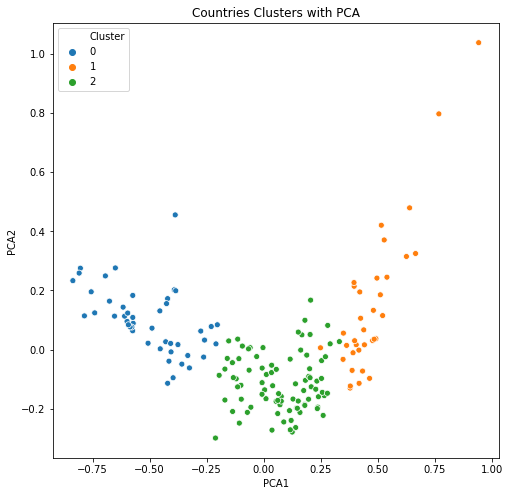

# 🌍 Unsupervised Learning on Country Data

This project uses **unsupervised machine learning** to classify countries into three economic categories — **Developed**, **Developing**, and **Poor (Least Developed)** — based on various health and economic indicators.

---

## Clusters Visualization



---

## 📂 Dataset

- **Source**: [Kaggle - Unsupervised Learning on Country Data](https://www.kaggle.com/datasets/rohan0301/unsupervised-learning-on-country-data)
- **Files Used**:
  - `Country-data.csv`: Contains economic and health indicators for various countries.
  - `Data-dictionary.csv`: Describes each feature in the dataset.

### 📊 Dataset Description

| **Column Name** | **Description** |
|-----------------|-----------------|
| `country`       | Name of the country |
| `child_mort`    | Death of children under 5 years of age per 1000 live births |
| `exports`       | Exports of goods and services per capita, given as % of the GDP per capita |
| `health`        | Total health spending per capita, given as % of GDP per capita |
| `imports`       | Imports of goods and services per capita, given as % of the GDP per capita |
| `income`        | Net income per person |
| `inflation`     | Annual growth rate of the Total GDP |
| `life_expec`    | Life expectancy at birth |
| `total_fer`     | Average number of children per woman |
| `gdpp`          | GDP per capita (Total GDP / Total Population) |

---

## 🔍 Objective

The aim is to apply **unsupervised clustering (KMeans)** on countries using relevant features and visualize the cluster separation using **Principal Component Analysis (PCA)**.

---

## 🛠️ Tech Stack

- Python
- Pandas, NumPy
- Matplotlib, Seaborn, Plotly
- Scikit-learn

---

## 📈 EDA and Preprocessing

- Visualized data distributions and correlations.
- Applied **MinMaxScaler** for normalization.
- Explored relationships between variables like `gdpp`, `income`, `child_mort`, and `health`.

### 📌 Visual Examples

- Histogram of GDP per capita
- Correlation heatmap
- Scatter plots using Plotly

---

## 🔗 Clustering with KMeans

- Optimal number of clusters determined using the **Elbow Method**.
- Final model trained with **K = 3**.
- Cluster assignments were visualized using both raw features and PCA.

### 🧪 PCA Visualization

PCA reduced high-dimensional data to 2D for visual analysis:

```python
from sklearn.decomposition import PCA

pca = PCA(n_components=2)
pca_data = pca.fit_transform(scaled_features)
