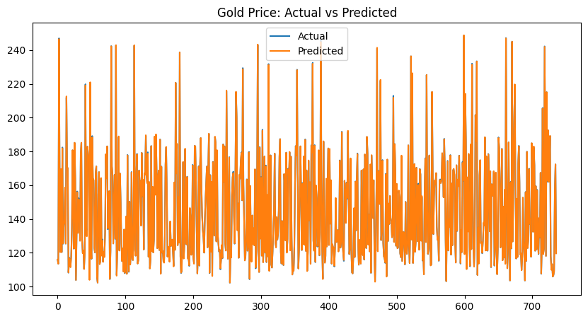

# 🟡 Gold Price Prediction using Financial Indicators (Regression)

This project aims to predict **Gold Prices** using macroeconomic and financial indicators through a **linear regression model**. The model is trained on various global financial factors, such as stock indices, interest rates, exchange rates, and commodity prices.

---

## Visualization

*(Plot comparing actual vs predicted gold prices)*

---

## 📁 Dataset

- **Source**: [Kaggle – Financial Data](https://www.kaggle.com/datasets/franciscogcc/financial-data?select=financial_regression.csv)`

### 🧾 Dataset Description

| **Column**            | **Description**                                                                 |
|------------------------|---------------------------------------------------------------------------------|
| **S&P 500**            | SPDR S&P 500 ETF Trust — benchmark index of top 500 US stocks.                 |
| **Nasdaq 100**         | Invesco QQQ ETF — tracks the Nasdaq-100 tech-heavy index.                      |
| **US Interest Rates**  | Monthly federal interest rates from the U.S. Federal Reserve.                  |
| **CPI**                | Consumer Price Index — reflects inflation levels.                              |
| **USD / CHF**          | Foreign exchange rate between USD and Swiss Franc.                             |
| **EUR / USD**          | Foreign exchange rate between Euro and USD.                                    |
| **GDP**                | Gross Domestic Product — quarterly economic output.                            |
| **Silver**             | abrdn Physical Silver Shares ETF — silver price indicator.                     |
| **Oil**                | USO ETF — tracks the price of crude oil.                                       |
| **Platinum**           | abrdn Physical Platinum Shares ETF.                                            |
| **Palladium**          | abrdn Physical Palladium Shares ETF.                                           |
| **Gold**               | SPDR Gold Trust ETF — **target variable** representing the gold price.         |

---

## ⚙️ Technologies Used

- Python 🐍
- Pandas, NumPy
- Matplotlib
- Scikit-learn (Linear Regression, Model Evaluation)

---

## 📌 Workflow

### 1. **Data Collection & Loading**
- The dataset is loaded into a Pandas DataFrame and inspected for nulls and irrelevant columns.

### 2. **Data Preprocessing**
- Dropped columns with excessive missing or low-informative data: `GDP`, `CPI`, `us_rates_%`.
- Converted `date` column to datetime and extracted year, month, day features.
- Removed any remaining null values.

### 3. **Feature Engineering**
- Extracted temporal features from `date`.
- Dropped `date` to avoid data leakage.

### 4. **Train/Test Split**
- Split dataset into training and testing sets (80/20 split).

### 5. **Model Building**
- Implemented a **Linear Regression** model using `scikit-learn`.

### 6. **Evaluation Metrics**
- Mean Absolute Error (MAE)
- Mean Squared Error (MSE)
- Root Mean Squared Error (RMSE)
- R² Score

---

## ✅ Results

| **Metric**     | **Value** |
|----------------|-----------|
| MAE            | 0.20      |
| MSE            | 0.08      |
| RMSE           | 0.27      |
| R² Score       | 1.00      |

> The model shows excellent performance on test data, suggesting a near-perfect fit for the selected financial indicators.

---

## 📈 Visualization

*(Plot comparing actual vs predicted gold prices)*

---

## 🚀 Future Improvements

- Use ensemble models like Random Forest, XGBoost for better generalization.
- Include lag-based features for better temporal learning.
- Integrate additional macroeconomic indicators (e.g., inflation forecast, unemployment rates).
- Perform hyperparameter tuning for better accuracy and robustness.

---