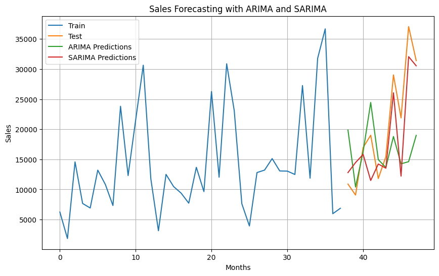

# 📈 Store Sales Forecasting

This project performs **time series analysis and forecasting** on sales data from a furniture store. Using ARIMA and SARIMA models, we aim to predict future sales trends by analyzing historical transactional data.

---

## Visualization



---

## 🗃️ Dataset

* **Source**: [Kaggle - Store Sales Forecasting Dataset](https://www.kaggle.com/datasets/tanayatipre/store-sales-forecasting-dataset/data?select=stores_sales_forecasting.csv)


### 📌 Dataset Features

| Column Name   | Description                                |
| ------------- | ------------------------------------------ |
| Row ID        | Unique identifier for each entry           |
| Order ID      | Unique identifier for each order           |
| Order Date    | Date when the order was placed             |
| Ship Date     | Date when the order was shipped            |
| Ship Mode     | Shipping method used                       |
| Customer ID   | Unique identifier for each customer        |
| Customer Name | Name of the customer                       |
| Segment       | Market segment (e.g., Consumer, Corporate) |
| Country       | Country where the order was placed         |
| City          | City where the order was placed            |
| State         | State where the order was placed           |
| Postal Code   | Postal code of the customer                |
| Region        | Geographic region                          |
| Product ID    | Unique identifier for the product          |
| Category      | Category of the product (e.g., Furniture)  |
| Sub-Category  | Sub-category of the product                |
| Product Name  | Name of the product                        |
| Sales         | Total sales amount                         |
| Quantity      | Quantity of items purchased                |
| Discount      | Discount applied                           |
| Profit        | Profit generated from the sale             |

---

## 📊 Project Workflow

### 1. Data Exploration & Cleaning

* Checked data types, missing values, and duplicates
* Dropped non-contributing columns (`Row ID`, `Customer Name`, etc.)
* Converted `Order Date` to datetime and set it as index
* Aggregated data to monthly frequency for time series modeling

### 2. Exploratory Data Analysis (EDA)

* Sales, Quantity, Discount, and Profit distributions
* Monthly sales trends
* Scatter plots between Sales and Profit
* Time series decomposition (trend, seasonality, residual)

### 3. Stationarity Check

* Applied **ADF Test** to validate stationarity of the sales data
* Result: Stationary (p-value < 0.05)

### 4. Model Building

* **ARIMA(5,1,0)**
* **SARIMA(1,1,1)(1,1,1,12)** for capturing seasonal effects

### 5. Forecasting & Visualization

* Forecasted sales for the test period using both models
* Compared model predictions with actual data
* Visualized results with Matplotlib and Plotly

---

## 📈 Visualizations

* Distribution plots (Sales, Quantity, Profit)
* Monthly Sales Line Plot
* Seasonal Decomposition
* ACF & PACF plots
* ARIMA vs SARIMA Predictions

---

## 🧪 Model Summary

| Model  | AIC    | Seasonal | Key Insight                      |
| ------ | ------ | -------- | -------------------------------- |
| ARIMA  | 790.99 | ❌        | Simpler model, higher AIC        |
| SARIMA | 510.05 | ✅        | Captures seasonality, better fit |

> SARIMA performs significantly better than ARIMA due to seasonal nature of data.

---

## 🧠 Key Learnings

* Time series models like SARIMA handle seasonality better than basic ARIMA.
* Importance of making time series stationary before modeling.
* EDA helps identify unnecessary features and data patterns.
* Forecasting requires consistent resampling and clean datetime indexing.

---

## 🔧 Libraries Used

* `pandas`, `numpy`
* `matplotlib`, `seaborn`, `plotly`
* `statsmodels`, `sklearn`

---

## 🚀 How to Run

1. Clone the repo:

   ```bash
   git clone https://github.com/<your-username>/Store_Sales_Forecasting.git
   ```
2. Navigate to the folder:

   ```bash
   cd Store_Sales_Forecasting
   ```
3. Run the Jupyter Notebook:

   ```bash
   jupyter notebook Store_Sales_Forecasting.ipynb
   ```

---

## 📌 Future Improvements

* Hyperparameter tuning with GridSearch for ARIMA/SARIMA
* Deploy as a forecasting web app using Flask
* Try Facebook Prophet or LSTM for advanced modeling

---